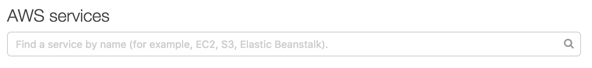
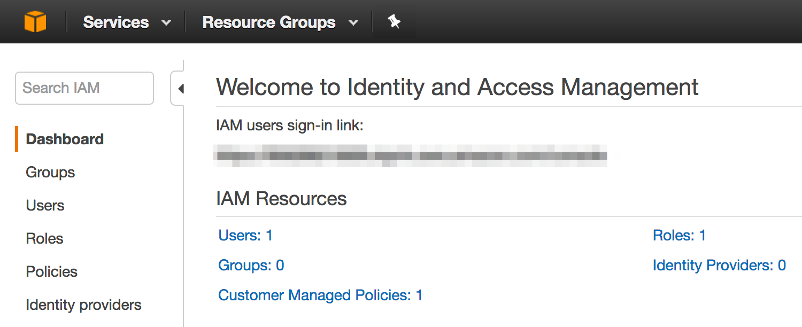
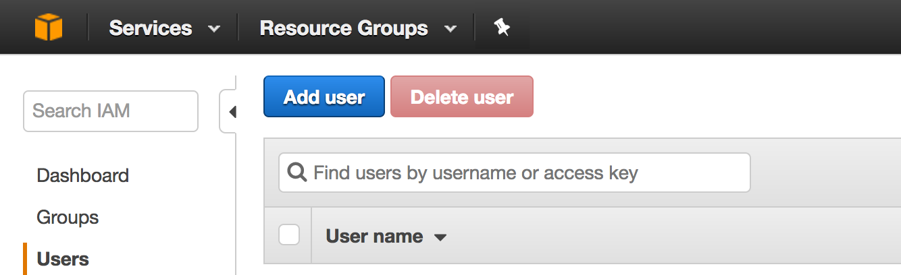
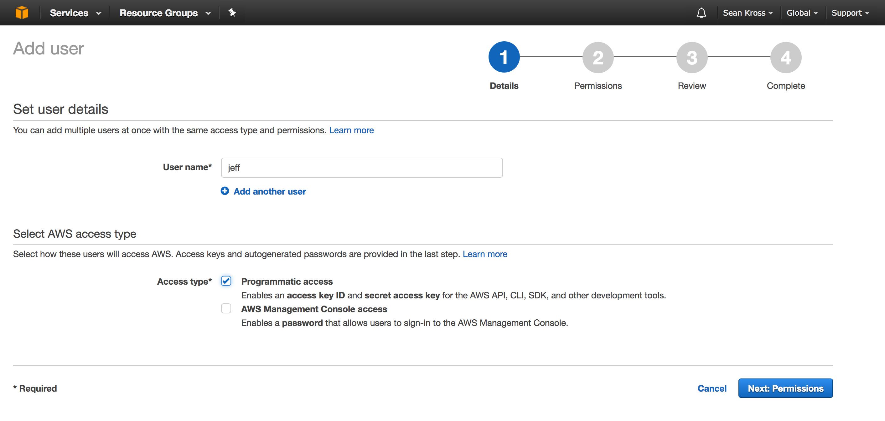
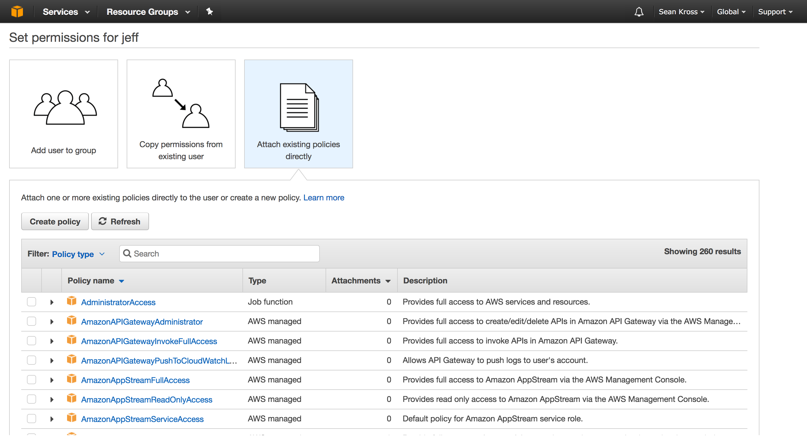
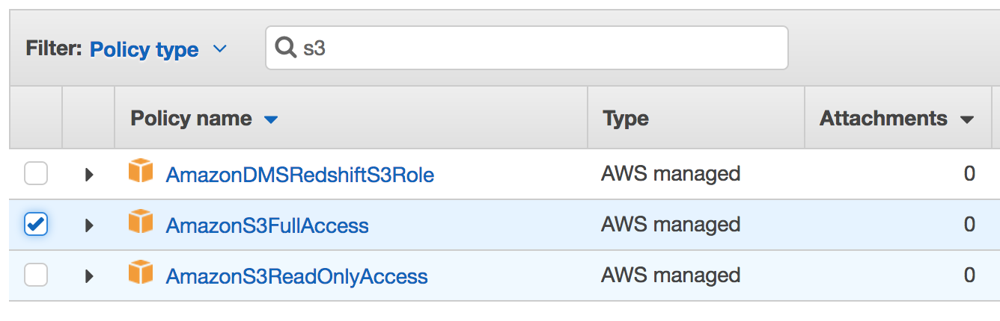
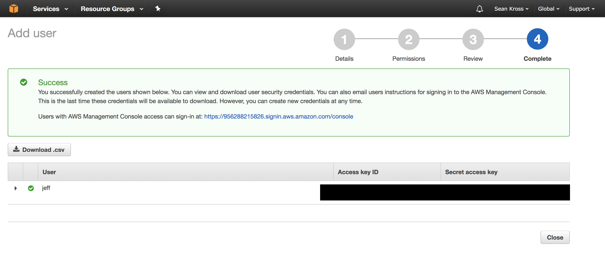

# Introduction

To follow along with this little tutorial, open a *FREE* account with AWS:

https://aws.amazon.com/free/

If you have an Amazon account, you can use that username and password to login. If not, simply create a new account. After providing some some basic information and completing the account process, look for a search bar like this one.



Type “IAM” into the search bar and click on the first result, Amazon’s [Identity and Access Management](https://aws.amazon.com/iam/) system. On the left side of the IAM dashboard you should see a menu item called “Users”.



Click on “Users” and then you should see yet another dashboard which will list the users you create. If you’re new to AWS then you shouldn’t see any user names listed! Click on the blue “Add user” button to create a new user.



In the user name field just enter a name that you can easily remember, and make sure to check the check box to give this user programmatic access.



After you’ve checked the box, you can click Next: Permissions, then you should see the screen below.



On this page you first need to select how you’re going to assign AWS permissions to this user. Click *Attach existing policies directly* so that you can specify which services you’re going to use. In this case, we are going to be using AWS s3 and EC2. Starting with the s3 component, type s3 into the search box. 



Amazon S3 is just a big hard drive that you can access over the internet (like a programmable Dropbox). Check the box next to AmazonS3FullAccess so that you can create and destroy files in Amazon S3. Go through a similar process for the EC2 service. If you wanted to use a different web service, you could search for the name of that service here to provide even more access to this user. You can always return to the permissions page to add more services later if needed.

When you’re finished, click Next: Review. On the following screen click Create user in order to get your credentials. You should now see this screen.



In order to use AWS in R you need two strings. 

- AWS_ACCESS_KEY_ID
- AWS_SECRET_ACCESS_KEY

Click *show* under the secret access key heading in order to see the secret access key. Copy and paste each key into a file for safe keeping or download the `csv` file version. **Never share these keys since anyone with them can use your AWS account**. 

> **After you leave this page you will never be able to retrieve the secret access key, so make sure you’ve recorded it.** 

Don’t worry if you lose your secret access key though, you can just create a new user to get a new key. After you have both keys you can click the *Close* button. You’re now ready to start using AWS in R!

Note: **Never share your AWS credentials, and never include them in ANY code. Instead, set environment variables or use an AWS credential file.**

# Amazon s3

Now let’s test out our big cloud hard drive with the `aws.s3` package which you can install with `install.packages("aws.s3")`. To use the package you’ll need to set up three environmental variables like I have below by specifying the `access key ID`, and the `secret access key` which we just set up, plus the *AWS region* which specifies the Amazon server farm geographically closest to you (usually). You can get a list of all regions for all services [here](http://docs.aws.amazon.com/general/latest/gr/rande.html#s3_region), and you click here to see which S3 regions are available.


```{r s3setup}
library(aws.s3)
```

```{r environ,eval=FALSE}
# Set up your keys and your region here.
# Note that you should not do this, but instead
# included this code in a .Rprofile file, a .Renviron 
# file, or an AWS config file (best option).
Sys.setenv("AWS_ACCESS_KEY_ID" = "EA6TDV7ASDE9TL2WI6RJ",
           "AWS_SECRET_ACCESS_KEY" = "OSnwITbMzcAwvHfYDEmk10khb3g82j04Wj8Va4AA",
           "AWS_DEFAULT_REGION" = "us-east-2")
```

Now, let's kick the tires a bit by creating a CSV file that we can store to the cloud.

```{r csvcreate}
# mtcars is a built-in data set. Let's create a new CSV file that we can upload
# to AWS S3.
write.csv(mtcars, "mtcars.csv", row.names = FALSE)
```

Now let’s upload this file to S3. Amazon organizes S3 into *buckets*, which are like named cloud hard drives. You *must* use a name that nobody else has used before, so we’re going to introduce some randomness to come up with a unique bucket name. The put_bucket() function creates the bucket.


```{r}
# Coming up with unique bucket names is tricky, so we'll add a random string
# to the name of this bucket.
bucket_name <- paste(c("bioc2017-test-", sample(c(0:9, letters), 
                                            size = 10, replace = TRUE)), collapse = "")

# Now we can create the bucket.
put_bucket(bucket_name,region='us-east-2')
```

```{r checkforbucket}
bucket_exists(bucket_name)
bucket_list_df()
```

Now we can put files in our bucket using put_object() by specifying which bucket we want to use:

```{r}
# Let's put our CSV file in the bucket.
put_object("mtcars.csv", bucket = bucket_name)
```

We can then pull files out of the bucket given the name of the file with the save_object() function. Let’s make sure the file we pulled out of the bucket is the same as the file we put in!

```{r}
# We've put data in The Cloud! Now let's get it back on our computer:
save_object("mtcars.csv", bucket = bucket_name, file = "mtcars_s3.csv")
```

```{r}
# Are the files the same?
mtcars_s3 <- read.csv("mtcars_s3.csv")
all.equal(mtcars, mtcars_s3)
# and delete the files
unlink('mtcars_s3.csv')
unlink('mtcars.csv')
```

Alternatively, we can read the object directly. The `get_object` function creates a `rawConnection` that we can read using many R input functions, such as `read.csv`.

```{r}
# Get the raw connection
rc = get_object('mtcars.csv',bucket_name)
# and convert to text.
m = read.csv(text=rawToChar(rc))
head(m)
```

We can do a one-step approach if we like using the `s3read_using` function:

```{r}
m1 = s3read_using(read.csv,object='mtcars.csv',bucket=bucket_name)
```

Looks like it works! We can also directly save and load to s3 using `s3save` and `s3saveRDS` and accompanying load functions.

Now let’s delete the hard drive we created since we won’t need to use it anymore.

```{r}
# We're finished with this bucket, so let's delete it.
delete_bucket(bucket_name)
```

*Always clean up after yourself during these experiments and you should not incur any charges.*

# EC2: Elastic Compute Cloud

Amazon Elastic Compute Cloud (Amazon EC2) is a service, accessible via a web-based API, that provides secure, resizable compute capacity in the cloud. It is designed to make web-scale cloud computing easier for developers and researchers. 

- *Scale*: Services like EC2 enable you to increase or decrease capacity at will, driven by computational demand. You can commission one, hundreds, or even thousands of server instances simultaneously. You can also use "Auto Scaling" to maintain availability of your EC2 fleet and automatically scale your applications up and down depending on needs and to maximize performance and minimize cost. 
- *Cost*: There are a [number of pricing options available](https://aws.amazon.com/ec2/pricing/spot-instances/), but for many bioinformatics workloads, using spot pricing may be acceptible and offers substantial discounts over "on demand" pricing. 
- *Security*: Cloud systems can be incredibly secure, but the security model used by all cloud providers is a "shared" security model. Like all of the big cloud providers, AWS supplies data center and network architecture designed to meet the requirements of the most security-sensitive organizations. However, the security of the systems that we set up, as users of the EC2 service, is up to us to maintain. 

AWS has a [Getting started with AWS ](https://aws.amazon.com/ec2/getting-started/) that you can use to create an instance using the web console, AWS SDK, or AWS command line tools.

## Creating and monitoring an AWS instance

This section details creating an AWS instance from within R. It assumes that you have your AWS key and secret available. We will be using the [preloaded AMI](http://bioconductor.org/help/bioconductor-cloud-ami/#preloaded_ami) from Bioconductor.

The package that will help us with the details is the `aws.ec2` package.

```{r installec2, eval=FALSE}
install.packages('aws.ec2')
```

```{r}
library(aws.ec2)
```

We will need a "keypair" to allow SSH access later.

```{r create_keypair}
keypair_name = 'bioc2017'
create_keypair('bioc2017',path = 'bioc2017.pem')
```

Next, we need to create a network configuration that will allow us to interact with the rstudio server that will be running on the AMI. This is messy, but follow along.

```{r}
s <- describe_subnets()[[1]]
g <- create_sgroup("biocAMI_group", "new security group", vpc = s)
authorize_ingress(g, cidr = '0.0.0.0/0', port = 80, protocol = "tcp")
authorize_ingress(g, cidr = '0.0.0.0/0', port = 22, protocol = "tcp")
```

```{r}
imageid = 'ami-a4697eb2'
# Launch the instance using appropriate settings
i <- run_instances(image = imageid, 
                   type = "t2.micro", # <- you might want to change this
                   subnet = s, 
                   sgroup = g)
```

Our AWS EC2 image is turning on. We can look into lots of details of the image, including getting the DNS name for connecting to the instance via RStudio server.

```{r results='hide'}
# RStudio Server will be available at the "publicIp" address returned in `i`
str(describe_instances(i))
dnsName = describe_instances(i)[[1]]$instancesSet[[1]]$dnsName
```

After a few minutes, we should be able to browse to the url with username `ubuntu` and password `bioc`.

```{r eval=FALSE}
browseURL(paste0('http://',dnsName))
```
And cleanup.


```{r results='hide',echo=FALSE}
Sys.sleep(120)
```

```{r results='hide'}
# Stop and terminate the instances
stop_instances(i[[1]])
# terminating an instance will result in losing
# any and all data!
terminate_instances(i[[1]])
# and cleanup our security group.
Sys.sleep(120)
delete_sgroup(g)
delete_keypair(keypair_name)
```


# sessionInfo

```{r}
sessionInfo()
```